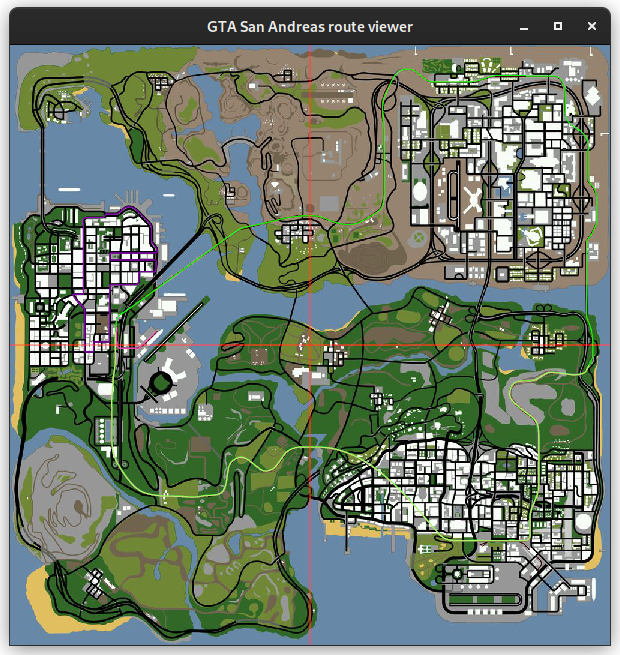

# GTA San Andreas rote viewer
The small app uses original GTA SA assets to draw paths and routes for vehicles, pedestrians, trains, boats, planes, etc., on a map.

## Setup

Clone repository: `git clone git@github.com:OCharnyshevich/gta-sa-route-viewer.git && cd gta-sa-route-viewer`

Run an application: `cargo run`

### Running example:

## Licensing
The project is under dual license MIT and Apache 2.0, so join to your hearts content, just remember the license agreements.

## Contributing
Yes this project is still very much WIP, so PRs are very welcome